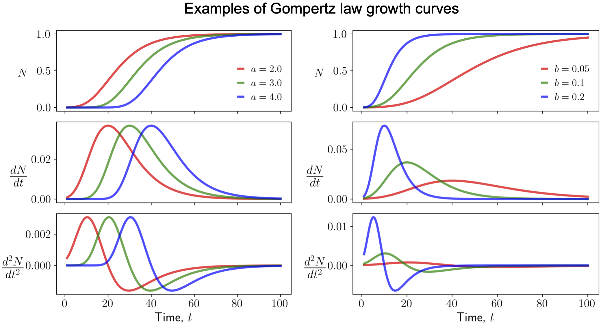

# ProVia

A collection of jupyter notebooks to analyze cell proliferation and viability measurements. Cell proliferation data is modeled using the Gompertz function:

```math
N = k e^{-e^{a-bt}}
```

<center></center>
