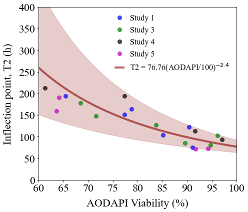
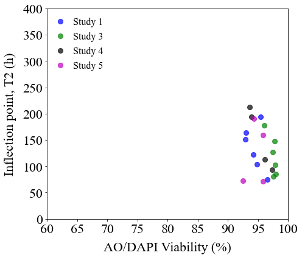

AODAPI viability and inflection points
======================================

.. code:: ipython3

    import numpy as np
    import scipy.optimize as optim
    import math
    import os,sys
    import pandas as pd
    import copy
    import scipy.stats as st
    from scipy.stats import t
    import matplotlib.pyplot as plt
    from matplotlib import rcParams
    
    import random as rand

**Read viability and T2 inflection points**

.. code:: ipython3

    cwd = os.getcwd()
    data_directory = './data/AODAPI'
    os.chdir(data_directory)
    
    aodapi_T2 = pd.read_csv('AODAPI-T2paired-Day1.csv')
    
    column_names = list(aodapi_T2)
    
    aodapis, t2s = {}, {}
    
    for c in column_names:
        if 'T2' in c:
            t2s[c] = [round(x,2) for x in aodapi_T2[c] if math.isnan(x) == False]
            print(c,'\t',t2s[c])
            
        if 'AODAPI' in c:
            aodapis[c] = [round(x,2) for x in aodapi_T2[c] if math.isnan(x) == False]
            print(c,'\t',aodapis[c])

.. parsed-literal::

    Study1_AODAPI 	 [91.05, 90.42, 85.12, 78.8, 77.35, 65.49, 62.27]
    Study1_T2 	 [74.93, 122.59, 104.11, 164.45, 150.77, 193.53, 443.6]
    Study3_AODAPI 	 [96.18, 94.71, 89.54, 83.76, 71.59, 68.47]
    Study3_T2 	 [102.31, 80.83, 85.02, 126.79, 147.27, 178.04]
    Study4_AODAPI 	 [97.09, 91.58, 77.33, 61.27]
    Study4_T2 	 [93.02, 113.0, 193.43, 212.21]
    Study5_AODAPI 	 [91.72, 94.21, 63.61, 64.17]
    Study5_T2 	 [71.64, 72.14, 159.66, 190.13]

**Fit :math:`\log[\mathrm{AODAPI}]`-vs-T2.**

.. code:: ipython3

    x, y = [], []
    
    for c in aodapis.keys():
        x += aodapis[c]
    
    for c in t2s.keys():
        y += t2s[c]
        
    dof = len(x) - 2
        
    x = np.array(x)/100
    y = np.array(y)
        
    result = st.linregress(np.log(x),np.log(y),alternative='two-sided')
        
    print(result)    

.. parsed-literal::

    LinregressResult(slope=-2.386117710101085, intercept=4.3406484978039686, rvalue=-0.8571336853655246, pvalue=6.957401776983424e-07, stderr=0.3289675081083341, intercept_stderr=0.09084907311224924)

**Reduced :math:`\chi^2` error:**

.. code:: ipython3

    residual = np.exp(result.slope*np.log(x) + result.intercept) - y
    
    reduced_chi2 = math.sqrt(np.dot(residual,residual)/(x.shape[0]-2))
    
    print(reduced_chi2)

.. parsed-literal::

    54.571758503185855

.. code:: ipython3

    mean_aodapi = np.linspace(60,100,100)
    t2 = np.exp(result.slope*np.log(mean_aodapi/100) + result.intercept)
    
    fitname = r'T2 = ' + str(round(math.exp(result.intercept),2)) + '(AODAPI/100)$^{'+ str(round(result.slope,1)) + '}$'

**Compute upper and lower bounds of the fit using 95% CI of the fit
parameters.**

.. code:: ipython3

    tinv = lambda p, df: abs(t.ppf(p/2,df))
    ts = tinv(0.05,dof)
    
    s_err = ts*result.stderr
    i_err = ts*result.intercept_stderr

.. code:: ipython3

    s_up, i_up = result.slope + s_err, result.intercept - i_err
    s_low, i_low = result.slope - s_err, result.intercept + i_err
    
    t2_up = np.exp(s_up*np.log(mean_aodapi/100) + i_up)
    t2_low = np.exp(s_low*np.log(mean_aodapi/100) + i_low)

.. code:: ipython3

    studies = ['Study1','Study3','Study4','Study5']
    
    fig, axs = plt.subplots(figsize=(7,6))
    
    rcParams['font.family'] = 'sans-serif'
    rcParams['font.sans-serif'] = ['Times New Roman']
    
    color_list = {'Study1':'blue','Study3':'green','Study4':'black','Study5':'m'}
    
    for s in studies:
        labelname = s.replace('Study','Study ')
        plt.plot(aodapis[s+'_AODAPI'],t2s[s+'_T2'],marker='o',ms=8,color=color_list[s],alpha=0.7,linewidth=0,label=labelname)
    
    plt.plot(mean_aodapi,t2,linewidth=4,color='#880000',alpha=0.6,label=fitname)
    
    plt.fill_between(mean_aodapi,t2_up,t2_low,alpha=0.2,color='#880000')
    
    plt.xticks(size=22)
    plt.yticks(size=22)  
    plt.xlabel(r'AO/DAPI Viability (%)',size=22,labelpad=10)
    plt.ylabel(r'Inflection point, T2 (h)',size=22,rotation=90,labelpad=10)
    plt.xlim(60,100)
    plt.ylim(0,400)
    plt.legend(frameon=False,prop={'size': 16,'family':'Times New Roman'},markerscale=1.0,handlelength=1.0,loc='upper right')
    plt.tight_layout()
    
    plt.savefig('AODAPI_day1.png',dpi=300)

**AO/DAPI Day 0 viability.**

.. code:: ipython3

    aodapi_T2_d0 = pd.read_csv('AODAPI-T2paired-Day0.csv')
    
    column_names = list(aodapi_T2_d0)
    
    aodapis_d0, t2s_d0 = {}, {}
    
    for c in column_names:
        if 'T2' in c:
            t2s_d0[c] = [round(x,2) for x in aodapi_T2_d0[c] if math.isnan(x) == False]
            print(c,'\t',t2s_d0[c])
            
        if 'AODAPI' in c:
            aodapis_d0[c] = [round(x,2) for x in aodapi_T2_d0[c] if math.isnan(x) == False]
            print(c,'\t',aodapis_d0[c])

.. parsed-literal::

    Study1_AODAPI 	 [96.59, 94.2, 94.84, 93.06, 92.93, 95.44]
    Study1_T2 	 [74.93, 122.59, 104.11, 164.45, 150.77, 193.53]
    Study3_AODAPI 	 [97.86, 97.59, 97.94, 97.43, 97.78, 96.09]
    Study3_T2 	 [102.31, 80.83, 85.02, 126.79, 147.27, 178.04]
    Study4_AODAPI 	 [97.37, 96.14, 93.89, 93.66]
    Study4_T2 	 [93.02, 113.0, 193.43, 212.21]
    Study5_AODAPI 	 [95.8, 92.53, 95.82, 94.37]
    Study5_T2 	 [71.64, 72.14, 159.66, 190.13]

.. code:: ipython3

    studies = ['Study1','Study3','Study4','Study5']
    
    fig, axs = plt.subplots(figsize=(7,6))
    
    rcParams['font.family'] = 'sans-serif'
    rcParams['font.sans-serif'] = ['Times New Roman']
    
    color_list = {'Study1':'blue','Study3':'green','Study4':'black','Study5':'m'}
    
    for s in studies:
        labelname = s.replace('Study','Study ')
        plt.plot(aodapis_d0[s+'_AODAPI'],t2s_d0[s+'_T2'],marker='o',ms=8,color=color_list[s],alpha=0.7,linewidth=0,label=labelname)
    
    plt.xticks(size=22)
    plt.yticks(size=22)  
    plt.xlabel(r'AO/DAPI Viability (%)',size=22,labelpad=10)
    plt.ylabel(r'Inflection point, T2 (h)',size=22,rotation=90,labelpad=10)
    plt.xlim(60,100)
    plt.ylim(0,400)
    plt.legend(frameon=False,prop={'size': 16,'family':'Times New Roman'},markerscale=1.0,handlelength=1.0,loc='upper left')
    plt.tight_layout()
    
    plt.savefig('AODAPI_day0.png',dpi=300)

