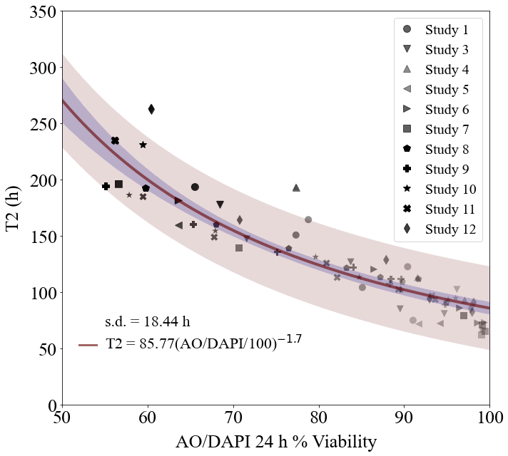
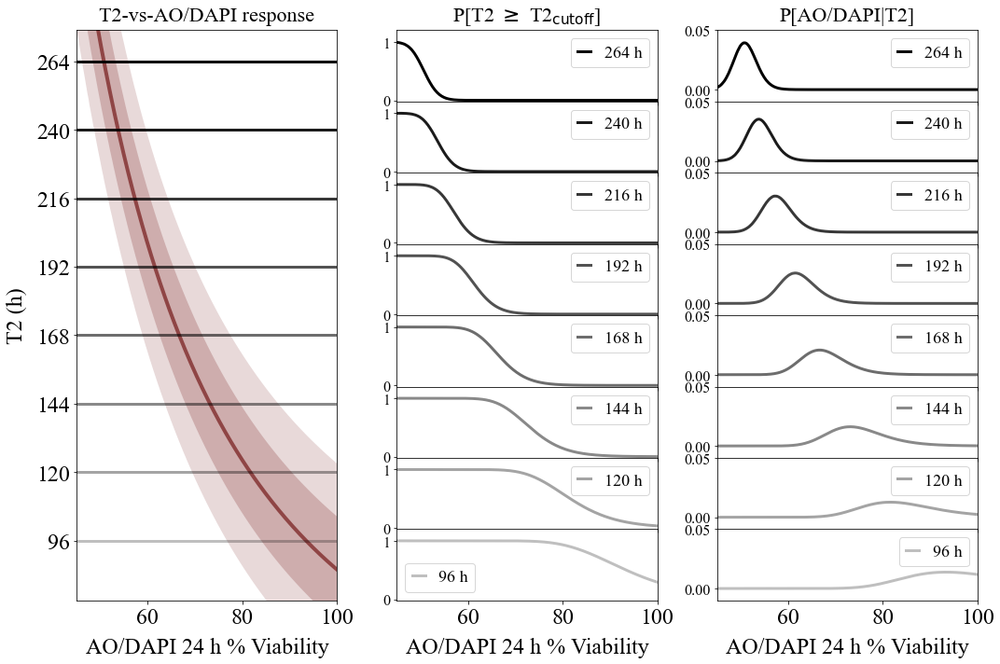
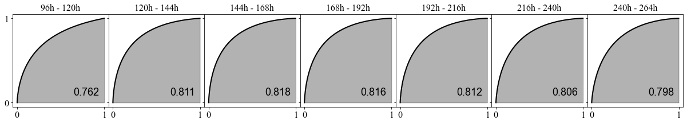
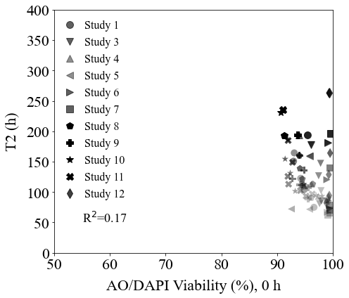

AO/DAPI % viability-vs-T2
=========================

**Nonlinear regression analysis between AO/DAPI % viability and proliferation infection point.**

.. code:: ipython3

    import numpy as np
    import scipy.optimize as optim
    import math
    import os,sys
    import pandas as pd
    import copy
    import scipy.stats as st
    from scipy.stats import t
    import matplotlib.pyplot as plt
    from matplotlib import rcParams

    import random as rand

    import scipy.stats as st

    from sklearn.metrics import auc

    import copy

.. code:: ipython3

    def nonlinear(x,a,b):
        return (a*(np.power(x,b)))

**Read viability and T2 inflection points**

.. code:: ipython3

    cwd = os.getcwd()
    data_directory = './data/AODAPI'
    os.chdir(data_directory)

    aodapi_T2 = pd.read_csv('AODAPI-T2paired-Day1.csv')

    column_names = list(aodapi_T2)

    aodapis, t2s, ths = {}, {}, {}

    for c in column_names:
        if 'T2' in c:
            t2s[c] = [round(x,2) for x in aodapi_T2[c] if math.isnan(x) == False]

        if 'AODAPI' in c:
            aodapis[c] = [round(x,2) for x in aodapi_T2[c] if math.isnan(x) == False]

        if 'TH' in c:
            ths[c] = [round(x,2) for x in aodapi_T2[c] if math.isnan(x) == False]

**Fit AO/DAPI % Viability-vs-T2**

.. code:: ipython3

    x, y = [], []

    for c in aodapis.keys():
        x += aodapis[c]

    for c in t2s.keys():
        y += t2s[c]

    dof = len(x) - 2

    x = np.array(x)/100
    y = np.array(y)

    result = st.linregress(np.log(x),np.log(y),alternative='two-sided')

    results = optim.curve_fit(nonlinear,x,y,full_output=True)

    popt, pcov = results[0], results[1]

    mean_aodapi = np.linspace(40,100,250)
    t2 = nonlinear(0.01*mean_aodapi,popt[0],popt[1])

    fitname = r'T2 = ' + str(round(popt[0],2)) + '(AO/DAPI/100)$^{'+ str(round(popt[1],1)) + '}$'

**Residual sum of squares:**

.. code:: ipython3

    residual = nonlinear(x,popt[0],popt[1]) - y

    norm_RSS = math.sqrt(np.dot(residual,residual)/(x.shape[0]-2))

    RSS_text = r's.d. = ' + str(round(norm_RSS,2)) + ' h'

**Compute the 95 % confidence interval (CI) for the regression analysis
and the 95 % prediction bound(PB) of the fit.**

.. code:: ipython3

    tinv = lambda p, df: abs(t.ppf(p/2,df))
    ts = tinv(0.05,dof)

    n_samples = 10000

    s_is, i_is = [], []

    cit2_up = np.zeros(shape=mean_aodapi.shape)
    cit2_low = np.zeros(shape=mean_aodapi.shape)

    pbt2_up = np.zeros(shape=mean_aodapi.shape)
    pbt2_low = np.zeros(shape=mean_aodapi.shape)

    sigmat2_up = np.zeros(shape=mean_aodapi.shape)
    sigmat2_low = np.zeros(shape=mean_aodapi.shape)

    t2 = np.zeros(shape=mean_aodapi.shape)
    effective_sigma = np.zeros(shape=mean_aodapi.shape)

    for i in range(0,mean_aodapi.shape[0]):
        samples = []

        a_samples, b_samples = np.random.multivariate_normal(popt,pcov,n_samples).T

        for a_sample,b_sample in zip(a_samples,b_samples):
            samples.append(nonlinear(0.01*mean_aodapi[i],a_sample,b_sample))

        t2[i] = nonlinear(0.01*mean_aodapi[i],popt[0],popt[1])

        sigma = np.std(samples)

        effective_sigma[i] = math.sqrt(sigma**2 + norm_RSS**2)

        ci95 = effective_sigma[i]*ts

        pbt2_low[i], pbt2_up[i] = t2[i] - ci95, t2[i] + ci95

        cit2_low[i], cit2_up[i] = t2[i] - sigma*ts, t2[i] + sigma*ts

        sigmat2_low[i], sigmat2_up[i] = t2[i] - effective_sigma[i], t2[i] + effective_sigma[i]

**Plot nonlinear regression analysis result**

.. code:: ipython3

    all_markers = ["o","v","^","<",">","s","p","P","*","X","d","D"]

    studies = ['Study1','Study3','Study4','Study5','Study6','Study7','Study8','Study9','Study10','Study11','Study12']

    fig, axs = plt.subplots(figsize=(10,9))

    rcParams['font.family'] = 'sans-serif'
    rcParams['font.sans-serif'] = ['Times New Roman']

    mi = 0

    for s in studies:
        labelname = s.replace('Study','Study ')

        alpha_s = 0.75*np.array(ths[s+'_TH'])/60.0 + 0.25

        plt.scatter(aodapis[s+'_AODAPI'],t2s[s+'_T2'],marker=all_markers[mi],s=100,color='black',alpha=alpha_s,linewidth=0)

        plt.plot(aodapis[s+'_AODAPI'][-1],t2s[s+'_T2'][-1],marker=all_markers[mi],ms=10,color='black',alpha=alpha_s[-1],linewidth=0,label=labelname)

        mi += 1

    plt.plot(mean_aodapi,t2,linewidth=4,color='#660000',alpha=0.6)

    plt.fill_between(mean_aodapi,pbt2_up,pbt2_low,alpha=0.15,color='#660000',linewidth=0.0)
    plt.fill_between(mean_aodapi,cit2_up,cit2_low,alpha=0.2,color='#000088',linewidth=0.0)

    plt.xticks(size=26)
    plt.yticks(size=26)
    plt.xlabel(r'AO/DAPI 24 h % Viability',size=26,labelpad=10)
    plt.ylabel(r'T2 (h)',size=26,rotation=90,labelpad=10)
    plt.xlim(50,100)
    plt.ylim(0,350)

    plt.plot(np.linspace(52,54,2),53*np.ones(2,),color='#660000',alpha=0.6,lw=3)

    plt.text(55,70,RSS_text,fontsize=22)
    plt.text(55,50,fitname,fontsize=22)

    plt.legend(frameon=True,prop={'size': 20,'family':'Times New Roman'},markerscale=1.0,handlelength=1.0,loc='upper right')

    plt.tight_layout()

    #plt.savefig('AODAPI_24h-vs-T2.png',dpi=300)

.. code:: ipython3

    #test_t2s = [96,108,120,132,144,156,168,180,192,204,216,228,240,252,264]
    test_t2s = [96,120,144,168,192,216,240,264]
    #test_t2s = [96,144,192,240]

    test_t2s.reverse()

    cutoff_probs = {}
    pdfs = {}
    cdfs = {}

    for k in test_t2s:
        cutoff_probs[k] = np.zeros(shape=mean_aodapi.shape)
        pdfs[k] = np.zeros(shape=mean_aodapi.shape)
        cdfs[k] = np.zeros(shape=mean_aodapi.shape)

    responses = np.zeros(shape=(len(test_t2s),mean_aodapi.shape[0]))

    j = 0

    for k in test_t2s:
        for i in range(0,mean_aodapi.shape[0]):
            cutoff_probs[k][i] = st.t.sf(k,df=dof,loc=t2[i],scale=effective_sigma[i])
            pdfs[k][i] = st.t.pdf(k,df=dof,loc=t2[i],scale=effective_sigma[i])

        pdfs[k] *= 1.0/np.sum(pdfs[k])
        x = copy.deepcopy(pdfs[k][::-1])
        sum_x = np.array([np.sum(x[m:]) for m in range(0,pdfs[k].shape[0])])

        cdfs[k] = sum_x[::-1]

        responses[j,:] = pdfs[k]

        j += 1

.. code:: ipython3

    fig = plt.figure(tight_layout=True,figsize=(15,10))
    gs = fig.add_gridspec(len(test_t2s),3, hspace=0)

    ax = fig.add_subplot(gs[:,0])
    ax.plot(mean_aodapi,t2,linewidth=4,color='#660000',alpha=0.6,label=fitname)
    ax.fill_between(mean_aodapi,pbt2_up,pbt2_low,alpha=0.15,color='#660000',linewidth=0.0)
    ax.fill_between(mean_aodapi,sigmat2_up,sigmat2_low,alpha=0.2,color='#660000',linewidth=0.0)

    ax.set_title(r'T2-vs-AO/DAPI response',size=22,pad=10)

    ax.tick_params(axis='both',labelsize=24)
    ax.set_yticks(test_t2s)
    ax.set_xlabel(r'AO/DAPI 24 h % Viability',size=24,labelpad=10)
    ax.set_ylabel(r'T2 (h)',size=24,rotation=90,labelpad=10)
    ax.set_ylim(75,275)
    ax.set_xlim(45,100)

    for t in test_t2s:
        _alpha = 0.25 + 0.75*(t - np.min(test_t2s))/(np.max(test_t2s) - np.min(test_t2s))

        ax.plot(mean_aodapi,t*np.ones(shape=mean_aodapi.shape[0]),color='black',lw=3,alpha=_alpha)

    for k in range(len(test_t2s)):
        ax = fig.add_subplot(gs[k,1])

        _alpha = 0.25 + 0.75*(test_t2s[k] - np.min(test_t2s))/(np.max(test_t2s) - np.min(test_t2s))

        ax.plot(mean_aodapi,cutoff_probs[test_t2s[k]],lw=3,color='black',label=str(test_t2s[k])+' h',alpha=_alpha)
        ax.tick_params(axis='y',labelsize=12)
        ax.set_ylim(-0.02,1.2)
        ax.set_xlim(45,100)
        ax.legend(frameon=True,prop={'size': 18,'family':'Times New Roman'},markerscale=1.0,handlelength=0.8,loc='best')

        ax.tick_params(axis='y',labelsize=16)

        if k==len(test_t2s)-1:
            ax.tick_params(axis='x',labelsize=24)
        else:
            ax.tick_params(axis='x',labelsize=0)

        if k==0:
            ax.set_title(r'P[T2 $\geq$ T2$_{\mathrm{cutoff}}$]',size=22,pad=10)

    ax.set_xlabel(r'AO/DAPI 24 h % Viability',size=24,labelpad=10)

    for k in range(len(test_t2s)):
        ax = fig.add_subplot(gs[k,2])

        _alpha = 0.25 + 0.75*(test_t2s[k] - np.min(test_t2s))/(np.max(test_t2s) - np.min(test_t2s))

        ax.plot(mean_aodapi,pdfs[test_t2s[k]],lw=3,color='black',label=str(test_t2s[k])+' h',alpha=_alpha)

        ax.tick_params(axis='y',labelsize=12)
        ax.set_xlim(45,100)
        ax.legend(frameon=True,prop={'size': 18,'family':'Times New Roman'},markerscale=1.0,handlelength=0.8,loc='best')

        ax.set_ylim(-0.01,0.05)

        ax.tick_params(axis='y',labelsize=16)

        if k==len(test_t2s)-1:
            ax.tick_params(axis='x',labelsize=24)
        else:
            ax.tick_params(axis='x',labelsize=0)

        if k==0:
            ax.set_title('P[AO/DAPI|T2]',size=22,pad=10)

    ax.set_xlabel(r'AO/DAPI 24 h % Viability',size=24,labelpad=10)

    #plt.savefig('AODAPI-T2-probabilities-combined-s10000.png',dpi=300)

.. parsed-literal::

    Text(0.5, 0, 'AO/DAPI 24 h % Viability')

.. code:: ipython3

    wd = 3

    l = int((len(test_t2s)-1)*wd)

    fig = plt.figure(figsize=(l,wd))
    gs = fig.add_gridspec(ncols=len(test_t2s)-1, nrows=1, wspace=0)

    axs = gs.subplots(sharex=True,sharey=True)

    all_aucs = []

    test_t2s = test_t2s[::-1]

    wf = open('auc_summary.csv','w')
    print('Time interval,AUC',file=wf)

    for k in range(0,len(test_t2s)-1):
        dx = cdfs[test_t2s[k]][::-1]
        dy = cdfs[test_t2s[k+1]][::-1]

        all_aucs.append(auc(dx,dy))

        label_text = str(round(all_aucs[-1],3))

        axs[k].plot(dx,dy,lw=2,color='black',label=label_text)
        axs[k].fill_between(dx,dy,0,color='black',alpha=0.3)#,label=str(test_t2s[k])+' h',alpha=_alpha)
        axs[k].set_xticks((0,1))
        axs[k].set_yticks((0,1))
        axs[k].tick_params(axis='both',labelsize=16)
        axs[k].legend(frameon=False,prop={'size': 18,'family':'Arial'},markerscale=1.0,handlelength=0.0,loc='lower right')
        axs[k].set_title(str(test_t2s[k])+'h - '+str(test_t2s[k+1])+'h',fontsize=16)

        output_string = str(test_t2s[k])+'h - '+str(test_t2s[k+1])+'h'
        output_string += ',' + label_text

        print(output_string,file=wf)

    wf.close()

**AO/DAPI Day 0 % viability.**

.. code:: ipython3

    aodapi_T2_d0 = pd.read_csv('AODAPI-T2paired-Day0.csv')

    column_names = list(aodapi_T2_d0)

    aodapis_d0, t2s_d0 = {}, {}

    for c in column_names:
        if 'T2' in c:
            t2s_d0[c] = [round(x,2) for x in aodapi_T2_d0[c] if math.isnan(x) == False]

        if 'AODAPI' in c:
            aodapis_d0[c] = [round(x,2) for x in aodapi_T2_d0[c] if math.isnan(x) == False]

        if 'TH' in c:
            ths[c] = [round(x,2) for x in aodapi_T2[c] if math.isnan(x) == False]

.. code:: ipython3

    all_aodapis, all_t2s = [], []

    for s in studies:
        all_aodapis += aodapis_d0[s+'_AODAPI']
        all_t2s += t2s_d0[s+'_T2']

.. code:: ipython3

    result = st.linregress(all_aodapis,all_t2s,alternative='two-sided')
    r2 = str(round(result.rvalue**2,3))

.. code:: ipython3

    all_markers = ["o","v","^","<",">","s","p","P","*","X","d","D"]

    studies = ['Study1','Study3','Study4','Study5','Study6','Study7','Study8','Study9','Study10','Study11','Study12']

    fig, axs = plt.subplots(figsize=(7,6))

    rcParams['font.family'] = 'sans-serif'
    rcParams['font.sans-serif'] = ['Times New Roman']

    mi = 0

    for s in studies:
        labelname = s.replace('Study','Study ')

        alpha_s = 0.75*np.array(ths[s+'_TH'])/60.0 + 0.25

        plt.scatter(aodapis_d0[s+'_AODAPI'],t2s_d0[s+'_T2'],marker=all_markers[mi],s=100,color='black',alpha=alpha_s,linewidth=0)

        plt.plot(aodapis_d0[s+'_AODAPI'][-1],t2s[s+'_T2'][-1],marker=all_markers[mi],ms=10,color='black',alpha=alpha_s[-1],linewidth=0,label=labelname)

        mi += 1

    plt.xticks(size=22)
    plt.yticks(size=22)
    plt.xlabel(r'AO/DAPI Viability (%), 0 h',size=22,labelpad=10)
    plt.ylabel(r'T2 (h)',size=22,rotation=90,labelpad=10)
    plt.xlim(50,100)
    plt.ylim(0,400)
    plt.text(55,50,r'R$^2$='+r2,fontsize=18)

    plt.legend(frameon=False,prop={'size': 16,'family':'Times New Roman'},markerscale=1.0,handlelength=1.0,loc='upper left')
    plt.tight_layout()

