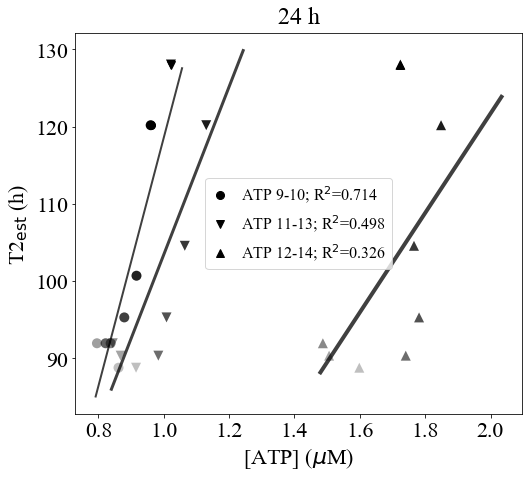

ATP conc.-vs-T2
===============

.. code:: ipython3

    import numpy as np
    import scipy.optimize as optim
    import math
    import os,sys
    import pandas as pd
    import copy
    import scipy.stats as st
    from scipy.stats import t
    import matplotlib.pyplot as plt
    from matplotlib import rcParams
    import random as rand

    import matplotlib.colors as mcolors

.. code:: ipython3

    def linear(x,a,b):
        return (a*x + b)

**Read viability and T2 inflection points**

.. code:: ipython3

    cwd = os.getcwd()
    data_directory = './data/ATP'
    os.chdir(data_directory)

    atp_T2 = pd.read_csv('atp_viability_day1-set1.csv')

.. code:: ipython3

    atp_keys = ['9-10','11-13','12-14']

    atps, t2s = {}, {}

    for k in atp_keys:
        k1 = 'ATP' + k
        k2 = 'AODAPI' + k

        atps[k] = []
        t2s[k] = []

        max_ATP = max(atp_T2[k1])
        min_ATP = min(atp_T2[k1])

        for v1,v2 in zip(atp_T2[k1],atp_T2[k2]):
            if np.isnan(v1)==False:
                atps[k].append(v1)

                t2s[k].append(85.77*((v2/100)**(-1.7)))

**Fit :math:`\log[\mathrm{ATP}]`-vs-T2.**

.. code:: ipython3

    r2s = {}

    for k in atp_keys:
        results = st.linregress(atps[k],t2s[k])

        r2s[k] = str(round(results.rvalue**2,3))

.. code:: ipython3

    for k in atp_keys:
        popt, pcov = optim.curve_fit(linear,atps[k],t2s[k])

.. code:: ipython3

    all_markers = ["o","v","^"]

    lws = [2,3,4]

    fig, axs = plt.subplots(figsize=(8,7))

    rcParams['font.family'] = 'sans-serif'
    rcParams['font.sans-serif'] = ['Times New Roman']

    selected_colors = []

    mi = 0

    for k in atp_keys:
        labelname = k.replace('Study','ATP-')

        alpha_s = np.linspace(0.25,1,len(atps[k]))

        plt.scatter(atps[k],t2s[k],marker=all_markers[mi],s=100,alpha=alpha_s,linewidth=0,color='black')

        popt, pcov = optim.curve_fit(linear,atps[k],t2s[k])

        atp_range = np.linspace(0.995*np.min(atps[k]),1.1*np.max(atps[k]),100)

        t2_range = linear(atp_range,popt[0],popt[1])

        plt.plot(atp_range,t2_range,lw=lws[mi],alpha=0.75,color='black')

        plt.plot(atps[k][-1],t2s[k][-1],ms=8,lw=0,marker=all_markers[mi],color='black',label='ATP '+labelname+'; R$^2$='+r2s[k])

        mi += 1

    plt.xticks(size=22)
    plt.yticks(size=22)

    plt.xlabel(r'[ATP] ($\mu$M)',size=22)
    plt.ylabel(r'T2$_{\mathrm{est}}$ (h)',size=22,rotation=90)
    plt.legend(frameon=True,prop={'size': 16,'family':'Times New Roman'},markerscale=1.0,handlelength=1.0,loc='best')
    plt.title('24 h',size=24,pad=10)

.. parsed-literal::

    Text(0.5, 1.0, '24 h')

