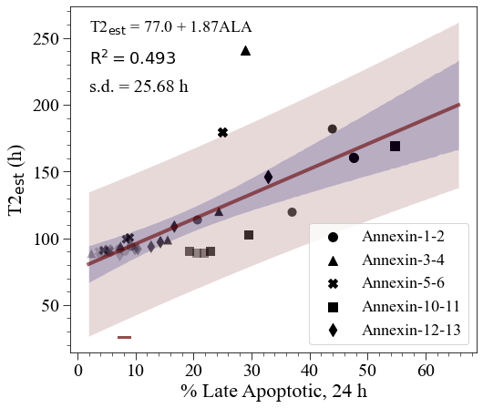
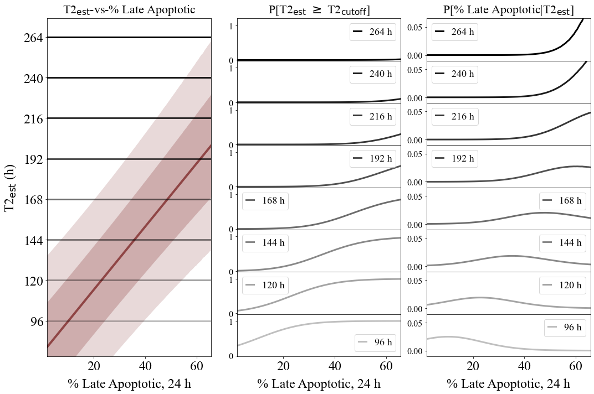
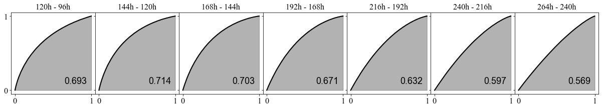

Annexin Late Apoptotic-vs-T2
============================

**Regression analysis of Annexin % Late Apoptotic cells and
proliferation inflection points.**

.. code:: ipython3

    import numpy as np
    import scipy.optimize as optim
    import math
    import os,sys
    import pandas as pd
    import copy
    import matplotlib.pyplot as plt
    from matplotlib import rcParams
    import scipy.stats as st
    from scipy.stats import t
    
    from sklearn.metrics import auc

.. code:: ipython3

    def linear(x,a,b):
        return (a + b*x)

.. code:: ipython3

    data_folder = './data/Annexin'
    os.chdir(data_folder)

**Read Annexin data**

.. code:: ipython3

    v24 = pd.read_csv('all-Annexin24h-data.csv')
    
    name_tag = {}
    
    name_tag['AH'] = 'Healthy cells (%)'
    name_tag['AEA'] = 'Early apoptotic cells (%)'
    name_tag['ALA'] = 'Late apoptotic cells (%)'
    name_tag['AN'] = 'Necrotic cells (%)'
    
    experiment_name = v24['Experiment name'].dropna().to_list()

.. code:: ipython3

    weight1 = pd.Series([0.2, 0.3, 0.4, 0.6, 0.7, 0.8, 0.9])
    colors1 = weight1.apply(lambda x: (0,0,0,x)).tolist()

.. code:: ipython3

    all_data = {}
    
    for n in list(v24):
        all_data[n] = v24[n].to_numpy()
    
    all_data['T2'] = 85.77*np.power(all_data['AODAPI']/100,-1.7)

.. code:: ipython3

    tag = 'ALA'
    
    result = st.linregress(all_data[tag],all_data['T2'],alternative='two-sided')
    
    r_text = r'$\mathrm{R}^2 = ' + str(round(result.rvalue**2,3)) + '$'

.. code:: ipython3

    results = optim.curve_fit(linear,all_data[tag],all_data['T2'],absolute_sigma=False,full_output=True)
    
    popt, pcov = results[0], results[1]
    
    p_std = np.sqrt(np.diag(pcov))
    
    fitname = r'T2$_{\mathrm{est}}$ = ' + str(round(popt[0],2)) + ' + ' + str(round(abs(popt[1]),2)) + tag

.. code:: ipython3

    dof = len(all_data['T2']) - 2
        
    tinv = lambda p, df: abs(t.ppf(p/2,df))
    ts = tinv(0.05,dof)
    
    s_err = ts*result.stderr
    i_err = ts*result.intercept_stderr

.. code:: ipython3

    residual = linear(all_data[tag],popt[0],popt[1]) - all_data['T2']
    norm_RSS = math.sqrt(np.dot(residual,residual)/(len(all_data['T2'])-2))
    RSS_text = r's.d. = ' + str(round(norm_RSS,2)) + ' h'

.. code:: ipython3

    d = all_data[tag]
    mean_x = np.linspace(0.8*np.min(d),1.2*np.max(d),100)
    mean_t2 = linear(mean_x,popt[0],popt[1])

**Compute confidence interval and prediction bound.**

.. code:: ipython3

    n_samples = 10000
    
    s_is, i_is = [], []
    
    cit2_up = np.zeros(shape=mean_x.shape)
    cit2_low = np.zeros(shape=mean_x.shape)
    
    pbt2_up = np.zeros(shape=mean_x.shape)
    pbt2_low = np.zeros(shape=mean_x.shape)
    
    sigmat2_up = np.zeros(shape=mean_x.shape)
    sigmat2_low = np.zeros(shape=mean_x.shape)
    
    t2 = np.zeros(shape=mean_x.shape)
    effective_sigma = np.zeros(shape=mean_x.shape)
    
    for i in range(0,mean_x.shape[0]):
        samples = []
        
        a_samples, b_samples = np.random.multivariate_normal(popt,pcov,n_samples).T
            
        for a_sample,b_sample in zip(a_samples,b_samples):
            samples.append(linear(mean_x[i],a_sample,b_sample))
            
        t2[i] = linear(mean_x[i],popt[0],popt[1])
            
        sigma = np.std(samples)
        
        effective_sigma[i] = math.sqrt(sigma**2 + norm_RSS**2)
        
        ci95 = effective_sigma[i]*ts
            
        pbt2_low[i], pbt2_up[i] = mean_t2[i] - ci95, mean_t2[i] + ci95
        
        cit2_low[i], cit2_up[i] = mean_t2[i] - sigma*ts, mean_t2[i] + sigma*ts
        
        sigmat2_low[i], sigmat2_up[i] = mean_t2[i] - effective_sigma[i], mean_t2[i] + effective_sigma[i]

.. code:: ipython3

    # Number of points in each set
    n = 7

.. code:: ipython3

    fig, axs = plt.subplots(figsize=(8,7))
    
    rcParams['font.family'] = 'sans-serif'
    rcParams['font.sans-serif'] = ['Times New Roman']
    
    plt.scatter(all_data[tag][:n],all_data['T2'][:n],marker='o',linewidth=0,s=100,c=colors1)
    plt.scatter(all_data[tag][n:2*n],all_data['T2'][n:2*n],marker='^',linewidth=0,s=100,c=colors1)
    plt.scatter(all_data[tag][2*n:3*n],all_data['T2'][2*n:3*n],marker='X',linewidth=0,s=100,c=colors1)
    plt.scatter(all_data[tag][3*n:4*n],all_data['T2'][3*n:4*n],marker='s',linewidth=0,s=100,c=colors1)
    plt.scatter(all_data[tag][4*n:],all_data['T2'][4*n:],marker='d',linewidth=0,s=100,c=colors1)
    
    plt.scatter(all_data[tag][n-1],all_data['T2'][n-1],marker='o',s=100,c='black',label=experiment_name[0])
    plt.scatter(all_data[tag][2*n-1],all_data['T2'][2*n-1],marker='^',s=100,c='black',label=experiment_name[1])
    plt.scatter(all_data[tag][3*n-1],all_data['T2'][3*n-1],marker='X',s=100,c='black',label=experiment_name[2])
    plt.scatter(all_data[tag][4*n-1],all_data['T2'][4*n-1],marker='s',s=100,c='black',label=experiment_name[3])
    plt.scatter(all_data[tag][-1],all_data['T2'][-1],marker='d',s=100,c='black',label=experiment_name[4])
    
    plt.plot(mean_x,mean_t2,alpha=0.6,lw=4,color='#660000')
    plt.fill_between(mean_x,pbt2_up,pbt2_low,alpha=0.15,color='#660000',linewidth=0.0)
    plt.fill_between(mean_x,cit2_up,cit2_low,alpha=0.2,color='#000066',linewidth=0.0)
    
    plt.xticks(size=20)
    plt.yticks(size=20)  
    plt.xlabel('% Late Apoptotic, 24 h',size=22)
    plt.ylabel(r'T2$_{\mathrm{est}}$ (h)',size=22,rotation=90)
    plt.minorticks_on()
    axs.tick_params(which='major', length=8)
    axs.tick_params(which='minor', length=4)
    plt.legend(frameon=True,prop={'size': 18},markerscale=1.0,handlelength=2.0,loc='lower right')
    plt.text(2,230,r_text,fontsize=18)
    plt.text(2,210,RSS_text,fontsize=20)
    
    plt.plot(np.linspace(7,9,2),26*np.ones(2,),color='#660000',alpha=0.7,lw=3)
    plt.text(2,255,fitname,fontsize=18)

.. parsed-literal::

    Text(2, 255, 'T2$_{\\mathrm{est}}$ = 77.0 + 1.87ALA')

**Compute survival function and conditional viability distribution.**

.. code:: ipython3

    #test_t2s = [96,108,120,132,144,156,168,180,192,204,216,228,240,252,264]
    test_t2s = [96,120,144,168,192,216,240,264]
    #test_t2s = [96,144,192,240]
    test_t2s.reverse()
    
    cutoff_probs = {}
    pdfs = {}
    cdfs = {}
    
    for k in test_t2s:
        cutoff_probs[k] = np.zeros(shape=mean_x.shape)
        pdfs[k] = np.zeros(shape=mean_x.shape)
        
    responses = np.zeros(shape=(len(test_t2s),mean_x.shape[0]))
    
    j = 0
    
    for k in test_t2s:
        for i in range(0,mean_x.shape[0]):
            cutoff_probs[k][i] = st.t.sf(k,df=dof,loc=t2[i],scale=effective_sigma[i])
            pdfs[k][i] = st.t.pdf(k,df=dof,loc=t2[i],scale=effective_sigma[i])
            
        pdfs[k] *= 1.0/np.sum(pdfs[k])
        
        x = copy.deepcopy(pdfs[k])#[::-1])
        cdfs[k] = np.round(np.array([np.sum(x[m:]) for m in range(0,pdfs[k].shape[0])] + [0]),3)
        
        responses[j,:] = pdfs[k]
        
        j += 1

.. code:: ipython3

    fig = plt.figure(tight_layout=True,figsize=(15,10))
    gs = fig.add_gridspec(len(test_t2s),3, hspace=0)
    
    ax = fig.add_subplot(gs[:,0])
    ax.plot(mean_x,t2,linewidth=4,color='#660000',alpha=0.6,label=fitname)
    ax.fill_between(mean_x,pbt2_up,pbt2_low,alpha=0.15,color='#660000',linewidth=0.0)
    ax.fill_between(mean_x,sigmat2_up,sigmat2_low,alpha=0.2,color='#660000',linewidth=0.0)
    
    ax.set_title(r'T2$_{\mathrm{est}}$-vs-% Late Apoptotic',size=22,pad=10)
    
    ax.tick_params(axis='both',labelsize=24)
    ax.set_yticks(test_t2s)
    ax.set_xlabel(r'% Late Apoptotic, 24 h',size=24,labelpad=10)
    ax.set_ylabel(r'T2$_{\mathrm{est}}$ (h)',size=24,rotation=90,labelpad=10)
    ax.set_ylim(75,275)
    ax.set_xlim(np.min(mean_x),np.max(mean_x))
    
    for t in test_t2s:
        _alpha = 0.25 + 0.75*(t - np.min(test_t2s))/(np.max(test_t2s) - np.min(test_t2s))
        
        ax.plot(mean_x,t*np.ones(shape=mean_x.shape[0]),color='black',lw=3,alpha=_alpha)
    
    for k in range(len(test_t2s)):
        ax = fig.add_subplot(gs[k,1])
        
        _alpha = 0.25 + 0.75*(test_t2s[k] - np.min(test_t2s))/(np.max(test_t2s) - np.min(test_t2s))
        
        ax.plot(mean_x,cutoff_probs[test_t2s[k]],lw=3,color='black',label=str(test_t2s[k])+' h',alpha=_alpha)
        ax.tick_params(axis='y',labelsize=12)
        ax.set_ylim(-0.02,1.2)
        ax.set_xlim(np.min(mean_x),np.max(mean_x))
        ax.legend(frameon=True,prop={'size': 18,'family':'Times New Roman'},markerscale=1.0,handlelength=0.8,loc='best')
    
        ax.tick_params(axis='y',labelsize=16)
        
        if k==len(test_t2s)-1:
            ax.tick_params(axis='x',labelsize=24)
        else:
            ax.tick_params(axis='x',labelsize=0)
            
        if k==0:
            ax.set_title(r'P[T2$_{\mathrm{est}}$ $\geq$ T2$_{\mathrm{cutoff}}$]',size=22,pad=10)
            
    ax.set_xlabel(r'% Late Apoptotic, 24 h',size=24,labelpad=10)
            
    for k in range(len(test_t2s)):
        ax = fig.add_subplot(gs[k,2])
        
        _alpha = 0.25 + 0.75*(test_t2s[k] - np.min(test_t2s))/(np.max(test_t2s) - np.min(test_t2s))
        
        ax.plot(mean_x,pdfs[test_t2s[k]],lw=3,color='black',label=str(test_t2s[k])+' h',alpha=_alpha)
        ax.tick_params(axis='y',labelsize=12)
        ax.set_xlim(np.min(mean_x),np.max(mean_x))
        ax.legend(frameon=True,prop={'size': 18,'family':'Times New Roman'},markerscale=1.0,handlelength=0.8,loc='best')
    
        ax.set_ylim(-0.01,0.065)
        
        ax.tick_params(axis='y',labelsize=16)
        
        if k==len(test_t2s)-1:
            ax.tick_params(axis='x',labelsize=24)
        else:
            ax.tick_params(axis='x',labelsize=0)
            
        if k==0:
            ax.set_title('P[% Late Apoptotic|T2$_{\mathrm{est}}$]',size=22,pad=10)
              
    ax.set_xlabel(r'% Late Apoptotic, 24 h',size=24,labelpad=10)

.. parsed-literal::

    Text(0.5, 0, '% Late Apoptotic, 24 h')

**Compute AUC values.**

.. code:: ipython3

    wd = 3
    
    l = int((len(test_t2s)-1)*wd)
    
    fig = plt.figure(figsize=(l,wd))
    gs = fig.add_gridspec(ncols=len(test_t2s)-1, nrows=1, wspace=0)
    
    axs = gs.subplots(sharex=True,sharey=True)
    
    all_aucs = []
    
    test_t2s = test_t2s[::-1]
    
    wf = open('auc_summary.csv','w')
    print('Time interval,AUC',file=wf)
    
    for k in range(0,len(test_t2s)-1):
        dx = copy.deepcopy(cdfs[test_t2s[k]][::-1])
        dy = copy.deepcopy(cdfs[test_t2s[k+1]][::-1])
        
        all_aucs.append(auc(dx,dy))
        
        label_text = str(round(all_aucs[-1],3))
        
        axs[k].plot(dx,dy,lw=2,color='black',label=label_text)
        axs[k].fill_between(dx,0,dy,color='black',alpha=0.3)#,label=str(test_t2s[k])+' h',alpha=_alpha)
        axs[k].set_xticks((0,1))
        axs[k].set_yticks((0,1))
        axs[k].tick_params(axis='both',labelsize=16)
        axs[k].legend(frameon=False,prop={'size': 18,'family':'Arial'},markerscale=1.0,handlelength=0.0,loc='lower right')
        axs[k].set_title(str(test_t2s[k+1])+'h - '+str(test_t2s[k])+'h',fontsize=16)
        
        output_string = str(test_t2s[k])+'h - '+str(test_t2s[k+1])+'h'
        output_string += ',' + label_text
        
        print(output_string,file=wf)
        
    wf.close()

