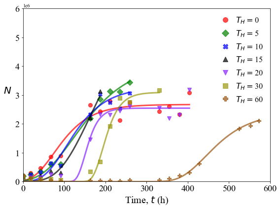

Model proliferation data with Gompertz law
==========================================

Live cell population growth is modeled using the Gompertz law:
:math:`N = k e^{-e^{a-bt}}`.

.. code:: ipython3

    import sys,os
    import numpy as np
    import pandas as pd
    import scipy.optimize as optim
    import functions
    import glob
    from scipy.stats import gamma
    import math
    import matplotlib.pyplot as plt
    from matplotlib import rcParams

Specify study name and the casename (prefix for the proliferation data
files).

.. code:: ipython3

    cwd = os.getcwd()
    data_directory = './data/Study1'
    os.chdir(data_directory)
    
    casename = 'growth_'
    
    data_files = glob.glob(casename+'*.csv')
    
    
    all_files = {}
    times = []
    
    for ff in data_files:
        t = float(ff.lstrip(casename).rstrip('.csv'))
        times.append(t)
        all_files[int(t)] = ff
    
    times.sort()

.. code:: ipython3

    p_array = np.zeros(shape=(len(data_files),10))
    column_names = ['T','k','kerr1','kerr2','a','aerr1','aerr2','b','berr1','berr2']
    parameters = pd.DataFrame(p_array,index=[i for i in range(0,len(data_files))],columns=column_names)
    
    column_names = ['CT','T1','T1err1','T1err2','T2','T2err1','T2err2']
    inflection_times = pd.DataFrame(np.zeros(shape=(len(data_files),7)),index=[i for i in range(0,len(data_files))],columns=column_names)
    report_inflection_times = pd.DataFrame(np.zeros(shape=(len(data_files),7)),index=[i for i in range(0,len(data_files))],columns=column_names)
    
    for idx in range(0,len(times)):
        t = times[idx]
        filename = all_files[int(t)]
    
        pop_series = pd.read_csv(filename)
    
        time_array = pop_series['Time (h)'].to_numpy()
        time_array = time_array.astype(float)
        time_size = time_array.shape[0]
    
        stack_size = time_size*(len(pop_series.columns.values)-1)
    
        time_stack = np.zeros(stack_size,)
        data_stack = np.zeros(stack_size,)
    
        time_l, data_l = [], []
    
        ik = 0
    
        n = len(pop_series.columns) - 2
    
        for col in pop_series.columns.values[1:]:
            this_data = pop_series[col].to_numpy()
    
            for p in range(0,this_data.shape[0]):
                if this_data[p]==this_data[p]:
                    time_l.append(time_array[p])
                    data_l.append(this_data[p])
    
        time_stack = np.array(time_l)
        data_stack = np.array(data_l)
    
        max_d = np.max(data_stack)
    
        max_inf_time = time_l[data_l.index(max_d)]
    
        m_d = max(data_l)
        t_inf = time_l[data_l.index(m_d)]
    
        check = 1
        iter = 0
    
        k_up, k_low = 2.0*m_d, 0.0
        b_up, b_low = 1.0/(time_array[1]-time_array[0]), 1.0/(time_array[-1]-time_array[0])
        a_up, a_low = max_inf_time*b_up, 0.0
    
    
        while check==1:
            all_bounds = (np.array([k_low,a_low,b_low]),np.array([k_up,a_up,b_up]))
    
            popt, pcov = optim.curve_fit(functions.gompertz,time_stack,data_stack,bounds=all_bounds)
            perr = np.sqrt(np.diag(pcov))
    
            check = 0
    
            iter += 1
    
        parameters.loc[idx,'T'] = t
        parameters.loc[idx,'k'] = popt[0]
        parameters.loc[idx,'a'] = popt[1]
        parameters.loc[idx,'b'] = popt[2]
        parameters.loc[idx,'kerr1'] = perr[0]
        parameters.loc[idx,'aerr1'] = perr[1]
        parameters.loc[idx,'berr1'] = perr[2]
        parameters.loc[idx,'kerr2'] = perr[0]
        parameters.loc[idx,'aerr2'] = perr[1]
        parameters.loc[idx,'berr2'] = perr[2]
    
        times_set = np.linspace(1,1000,10000)
    
        t1, t2 = functions.compute_gompertz_inflections(times_set,popt[0],popt[1],popt[2])
        
        inflection_times.loc[idx,'CT'] = t
        inflection_times.loc[idx,'T1'] = t1
        inflection_times.loc[idx,'T2'] = t2
        
        report_inflection_times.loc[idx,'CT'] = t
        report_inflection_times.loc[idx,'T1'] = t1
        report_inflection_times.loc[idx,'T2'] = t2
    
        T1_error = t1*(abs(perr[1]/popt[1]) + abs(perr[2]/popt[2]))
    
        up, low = functions.get_CI(t1,T1_error)
        
        inflection_times.loc[idx,'T1err1'] = up
        inflection_times.loc[idx,'T1err2'] = min(low,t1)
    
        report_inflection_times.loc[idx,'T1err1'] = max(t1 - low,0)
        report_inflection_times.loc[idx,'T1err2'] = t1 + up
    
        T2_error = t2*(abs(perr[1]/popt[1]) + abs(perr[2]/popt[2]))
    
        up, low = functions.get_CI(t2,T2_error)
        
        inflection_times.loc[idx,'T2err1'] = up
        inflection_times.loc[idx,'T2err2'] = min(low,t2)
    
        report_inflection_times.loc[idx,'T2err1'] = max(t2 - low,0)
        report_inflection_times.loc[idx,'T2err2'] = t2 + up
    
        rate_times = np.linspace(0.0,np.max(time_array),200)
        fit_N = functions.gompertz(rate_times,popt[0],popt[1],popt[2])
    
        total_data = np.zeros(shape=(rate_times.shape[0],2))
        total_data[:,0] = rate_times
        total_data[:,1] = fit_N
    
        np.savetxt('fit_'+filename,total_data,delimiter=',')

.. code:: ipython3

    parameters.rename(columns={'kerr1': '+','aerr1': '+', 'berr1': '+'}, inplace=True)
    parameters.rename(columns={'kerr2': '-','aerr2': '-', 'berr2': '-'}, inplace=True)
    
    inflection_times.rename(columns={'T1err1': '+','T1err2': '-'}, inplace=True)
    inflection_times.rename(columns={'T2err1': '+','T2err2': '-'}, inplace=True)
    
    report_inflection_times.rename(columns={'T1err1': 'Lower CI','T1err2': 'Upper CI'}, inplace=True)
    report_inflection_times.rename(columns={'T2err1': 'Lower CI','T2err2': 'Upper CI'}, inplace=True)
    
    parameters.to_csv('gompertz_parameter_summary.csv',index=None)
    inflection_times.to_csv('gompertz_inflection_points_summary.csv',index=None)
    
    report_inflection_times.to_csv('gompertz_inflection_points_report.csv',index=None)

.. code:: ipython3

    data_files = glob.glob(casename+'*.csv')
    
    fit_data_files = glob.glob('fit_'+casename+'*.csv')

.. code:: ipython3

    all_files = {}
    times = []
    
    for ff in data_files:
        t = float(ff.lstrip(casename).rstrip('.csv'))
        times.append(int(t))
        all_files[int(t)] = ff
    
    times.sort()

.. code:: ipython3

    ori_data = []
    fit_data = []
    
    for t in times:
        ori_data.append(pd.read_csv(casename+str(t)+'.csv').to_numpy())
        fit_data.append(pd.read_csv('fit_'+casename+str(t)+'.csv',header=None).to_numpy())

.. code:: ipython3

    fig, axs = plt.subplots(figsize=(8,6))
    
    rcParams['font.family'] = 'sans-serif'
    rcParams['font.sans-serif'] = ['Times New Roman']
    
    color_list = ['r','g','b','#000000','#8822ff','#999911','#995511']
    marker_list = ['o','D','X','^','v','s','P']
    
    for i in range(0,len(times)):
        c = color_list[i]
        plt.plot(ori_data[i][:,0],ori_data[i][:,1],marker=marker_list[i],ms=8,color=c,alpha=0.7,linewidth=0,label=r'$T_{H}= $'+str(times[i]))
        plt.plot(fit_data[i][:,0],fit_data[i][:,1],linewidth=3,color=c,alpha=0.7)
        
    plt.xticks(size=18)
    plt.yticks(size=18)  
    plt.xlabel(r'Time, $t$ (h)',size=20)
    plt.ylabel(r'$N$',size=20,rotation=0,labelpad=15)
    plt.xlim(0,600)
    plt.ylim(0,6000000)
    plt.legend(frameon=False,prop={'size': 16},markerscale=1.25,handlelength=1.0)
    plt.tight_layout()
    
    plt.savefig('proliferation_plot.png',dpi=600)
    
    os.chdir(cwd)

