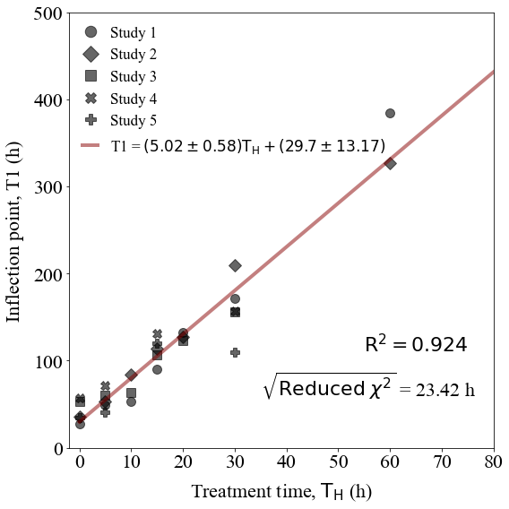
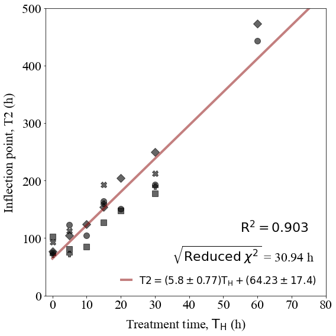
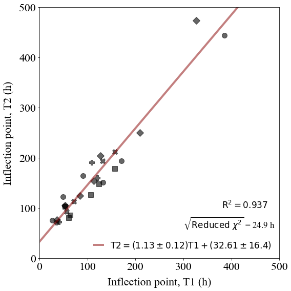

Analysis of inflection points
=============================

Determines the relationship between treatment time :math:`\mathrm{T_H}`
and the two inflection point times, :math:`\mathrm{T1}` and
:math:`\mathrm{T2}`, and also the relationship between the two
inflection points.

.. code:: ipython3

    import sys,os
    import numpy as np
    import pandas as pd
    import scipy.optimize as optim
    import functions
    import glob
    from scipy.stats import gamma
    import math
    import matplotlib.pyplot as plt
    from matplotlib import rcParams
    import scipy.stats as st
    import matplotlib.font_manager as font_manager
    from scipy.stats import t

.. code:: ipython3

    data_directory = './data/'
    os.chdir(data_directory)
    cwd = os.getcwd()
    
    studies = glob.glob('Study*')
    studies.sort()

.. code:: ipython3

    inflection_points = {}
    dof = -2 # Two parameters in the linear models
    
    for s in studies:
        os.chdir(s)
        
        inflection_points[s] = pd.read_csv('gompertz_inflection_points_summary.csv')
        
        dof += len(inflection_points[s]['CT'])
        
        os.chdir(cwd)
        
    print('Degrees of freedom: ',dof)

.. parsed-literal::

    Degrees of freedom:  26

.. code:: ipython3

    tinv = lambda p, df: abs(t.ppf(p/2,df))
    ts = tinv(0.05,dof)
    print(ts)

.. parsed-literal::

    2.0555294386428713

**Relationship between :math:`\mathrm{T_H}` and :math:`\mathrm{T1}`.**

.. code:: ipython3

    res = functions.fit_data(inflection_points,'CT','T1')
    
    s_err = ts*res.stderr
    i_err = ts*res.intercept_stderr
    
    res

.. parsed-literal::

    LinregressResult(slope=5.023194806546836, intercept=29.70445101576523, rvalue=0.9613495754354037, pvalue=2.1944412526757792e-16, stderr=0.2821412886107889, intercept_stderr=6.409461651055753)

.. code:: ipython3

    fitname = r'T1 = $(' + str(round(res.slope,2)) + '\pm ' + str(round(s_err,2)) + ')\mathrm{T_H} + ' 
    fitname += '(' + str(round(res.intercept,2)) + '\pm ' + str(round(i_err,2)) + ')$'
    
    x = np.linspace(0,80,100)
    y = res.slope*x + res.intercept
    
    r_text = r'$\mathrm{R}^2 = ' + str(round(res.rvalue**2,3)) + '$'
    
    reduced_chi = functions.goodness_of_fit(inflection_points,'CT','T1',res.slope,res.intercept)
    
    reduced_chi_text = r'$\sqrt{\mathrm{Reduced} \; \chi^2}$ = '+str(round(reduced_chi,2))+' h'

.. code:: ipython3

    fig, axs = plt.subplots(figsize=(8,8))
    
    rcParams['font.family'] = 'sans-serif'
    rcParams['font.sans-serif'] = ['Times New Roman']
    
    marker_list = {'Study1':'o','Study2':'D','Study3':'s','Study4':'X','Study5':'P'}
    
    for s in studies:
        labelname = s.replace('Study','Study ')
        plt.plot(inflection_points[s]['CT'],inflection_points[s]['T1'],marker=marker_list[s],ms=10,color='black',alpha=0.6,linewidth=0,label=labelname)
    
    plt.plot(x,y,linewidth=4,color='#880000',alpha=0.5,label=fitname)
    
    plt.text(55,100,r_text,fontsize=17)
    plt.text(40,60,reduced_chi_text,fontsize=17)
        
    plt.xticks(size=22)
    plt.yticks(size=22)  
    plt.xlabel(r'Treatment time, $\mathrm{T_H}$ (h)',size=22,labelpad=10)
    plt.ylabel(r'Inflection point, T1 (h)',size=22,rotation=90,labelpad=10)
    plt.xlim(-5,80)
    plt.ylim(0,500)
    plt.legend(frameon=False,prop={'size': 17,'family':'Times New Roman'},markerscale=1.25,handlelength=1.0,loc='upper left')
    plt.tight_layout()

**Relationship between :math:`\mathrm{T_H}` and :math:`\mathrm{T2}`.**

.. code:: ipython3

    res = functions.fit_data(inflection_points,'CT','T2')
    
    s_err = ts*res.stderr
    i_err = ts*res.intercept_stderr

.. code:: ipython3

    fitname = r'$\mathrm{T2} = (' + str(round(res.slope,2)) + '\pm ' + str(round(s_err,2)) + ')\mathrm{T_H} + ' 
    fitname += '(' + str(round(res.intercept,2)) + '\pm ' + str(round(i_err,2)) + ')$'
    
    x = np.linspace(0,80,100)
    y = res.slope*x + res.intercept
    
    r_text = r'$\mathrm{R}^2 = ' + str(round(res.rvalue**2,3)) + '$'
    
    reduced_chi = functions.goodness_of_fit(inflection_points,'CT','T2',res.slope,res.intercept)
    
    reduced_chi_text = r'$\sqrt{\mathrm{Reduced} \; \chi^2}$ = '+str(round(reduced_chi,2))+' h'

.. code:: ipython3

    fig, axs = plt.subplots(figsize=(8,8))
    
    rcParams['font.family'] = 'sans-serif'
    rcParams['font.sans-serif'] = ['Times New Roman']
    
    marker_list = {'Study1':'o','Study2':'D','Study3':'s','Study4':'X','Study5':'P'}
    
    for s in studies:
        labelname = s.replace('Study','Study ')
        plt.plot(inflection_points[s]['CT'],inflection_points[s]['T2'],marker=marker_list[s],ms=10,color='black',alpha=0.6,linewidth=0)
    
    plt.plot(x,y,linewidth=4,color='#880000',alpha=0.5,label=fitname)
    
    plt.text(55,100,r_text,fontsize=17)
    plt.text(40,60,reduced_chi_text,fontsize=17)
        
    plt.xticks(size=22)
    plt.yticks(size=22)  
    plt.xlabel(r'Treatment time, $\mathrm{T_H}$ (h)',size=22,labelpad=10)
    plt.ylabel(r'Inflection point, T2 (h)',size=22,rotation=90,labelpad=10)
    plt.xlim(-5,80)
    plt.ylim(0,500)
    plt.legend(frameon=False,prop={'size': 17,'family':'Times New Roman'},markerscale=1.25,handlelength=1.0,loc='lower right')
    plt.tight_layout()

**Relationship between :math:`\mathrm{T1}` and :math:`\mathrm{T2}`.**

.. code:: ipython3

    res = functions.fit_data(inflection_points,'T1','T2')
    
    s_err = ts*res.stderr
    i_err = ts*res.intercept_stderr

.. code:: ipython3

    fitname = r'$\mathrm{T2} = (' + str(round(res.slope,2)) + '\pm ' + str(round(s_err,2)) + ')\mathrm{T1} + ' 
    fitname += '(' + str(round(res.intercept,2)) + '\pm ' + str(round(i_err,2)) + ')$'
    
    x = np.linspace(0,600,100)
    y = res.slope*x + res.intercept
    
    r_text = r'$\mathrm{R}^2 = ' + str(round(res.rvalue**2,3)) + '$'
    
    reduced_chi = functions.goodness_of_fit(inflection_points,'T1','T2',res.slope,res.intercept)
    
    reduced_chi_text = r'$\sqrt{\mathrm{Reduced} \; \chi^2}$ = '+str(round(reduced_chi,2))+' h'

.. code:: ipython3

    fig, axs = plt.subplots(figsize=(8,8))
    
    rcParams['font.family'] = 'sans-serif'
    rcParams['font.sans-serif'] = ['Times New Roman']
    
    marker_list = {'Study1':'o','Study2':'D','Study3':'s','Study4':'X','Study5':'P'}
    
    for s in studies:
        labelname = s.replace('Study','Study ')
        plt.plot(inflection_points[s]['T1'],inflection_points[s]['T2'],marker=marker_list[s],ms=10,color='black',alpha=0.6,linewidth=0)
    
    plt.plot(x,y,linewidth=4,color='#880000',alpha=0.5,label=fitname)
    plt.text(380,100,r_text,fontsize=17)
    plt.text(300,60,reduced_chi_text,fontsize=17)
        
    plt.xticks(size=22)
    plt.yticks(size=22)  
    plt.xlabel('Inflection point, T1 (h)',size=22,labelpad=10)
    plt.ylabel('Inflection point, T2 (h)',size=22,rotation=90,labelpad=10)
    plt.xlim(0,500)
    plt.ylim(0,500)
    plt.legend(frameon=False,prop={'size': 17,'family':'Times New Roman'},markerscale=1.25,handlelength=1.0,loc='lower right')
    plt.tight_layout()

