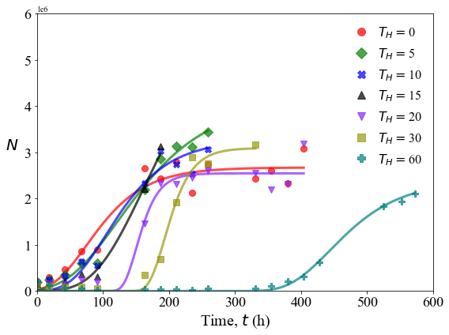

Analysis of inflection points
=============================

**Determines the relationship between treatment time
:math:`\mathrm{T_H}` and the two inflection point times,
:math:`\mathrm{T1}` and :math:`\mathrm{T2}`, and also the relationship
between the two inflection points.**

.. code:: ipython3

    import sys,os
    import numpy as np
    import pandas as pd
    import scipy.optimize as optim
    import functions
    import glob
    from scipy.stats import gamma
    import math
    import matplotlib.pyplot as plt
    from matplotlib import rcParams
    import scipy.stats as st
    import matplotlib.font_manager as font_manager
    from scipy.stats import t
    
    from matplotlib.lines import Line2D

.. code:: ipython3

    def linear(x,a,b):
        return (a + b*x)

.. code:: ipython3

    data_directory = './data/'
    os.chdir(data_directory)
    cwd = os.getcwd()
    
    studies = glob.glob('Study*')
    
    n = [int(s.lstrip('Study')) for s in studies]
    n.sort()
    
    studies = ['Study'+str(ni) for ni in n]

**Specify inflection points to neglect from specific studies.**

.. code:: ipython3

    studies_to_neglect = {}
    
    studies_to_neglect = {'Study1':[60],'Study2':[60],'Study3':[60],'Study4':[30],
                         'Study5':[30],'Study6':[60],'Study7':[60],'Study8':[],
                         'Study9':[],'Study10':[],'Study11':[],'Study12':[60]}

.. code:: ipython3

    inflection_points = {}
    dof = -2 # Two parameters in the linear models
    
    for s in studies:
        os.chdir(s)
        
        inflection_points[s] = pd.read_csv('gompertz_inflection_points_summary.csv')
        
        for tH in studies_to_neglect[s]:
            tH_vals = inflection_points[s].index[inflection_points[s]['CT'] == tH].tolist()[0]
            
            inflection_points[s] = inflection_points[s].drop(inflection_points[s].index[tH_vals])
            
        dof += len(inflection_points[s]['CT'])
        
        os.chdir(cwd)

.. code:: ipython3

    tinv = lambda p, df: abs(t.ppf(p/2,df))
    ts = tinv(0.05,dof)

**Relationship between :math:`\mathrm{T_H}` and :math:`\mathrm{T1}`.**

.. code:: ipython3

    th, t1s = [], []
    
    for s in studies:
        th += inflection_points[s]['CT'].to_list()
        t1s += inflection_points[s]['T1'].to_list()
    
    results = optim.curve_fit(linear,th,t1s,full_output=True)
    
    popt, pcov = results[0], results[1]
    
    x = np.linspace(0,80,100)
    t1 = linear(x,popt[0],popt[1])
    
    residual = linear(np.array(th),popt[0],popt[1]) - np.array(t1s)
    
    norm_RSS = math.sqrt(np.dot(residual,residual)/(len(t1s)-2))
    
    RSS_text = r's.d. = ' + str(round(norm_RSS,2)) + ' h'
    
    res = st.linregress(th,t1s)

.. code:: ipython3

    fitname = r'T1 = ' + str(round(res.slope,2)) + '$\mathrm{T_H}$ + ' + str(round(res.intercept,2))
    
    x = np.linspace(0,80,100)
    y = res.slope*x + res.intercept
    
    r_text = r'$\mathrm{R}^2 = ' + str(round(res.rvalue**2,3)) + '$'

.. code:: ipython3

    n_samples = 10000
    
    s_is, i_is = [], []
    
    t1_up = np.zeros(shape=x.shape)
    t1_low = np.zeros(shape=x.shape)
    
    rt1_up = np.zeros(shape=x.shape)
    rt1_low = np.zeros(shape=x.shape)
    
    effective_sigma = np.zeros(shape=x.shape)
    
    for i in range(0,x.shape[0]):
        samples = []
        
        a_samples, b_samples = np.random.multivariate_normal(popt,pcov,n_samples).T
            
        for a_sample,b_sample in zip(a_samples,b_samples):
            samples.append(linear(x[i],a_sample,b_sample))
            
        sigma = np.std(samples)
        
        effective_sigma[i] = math.sqrt(sigma**2 + norm_RSS**2)
        
        ci95 = effective_sigma[i]*ts
        
        t1_low[i], t1_up[i] = t1[i] - ci95, t1[i] + ci95
        
        rt1_low[i], rt1_up[i] = t1[i] - sigma*ts, t1[i] + sigma*ts

.. code:: ipython3

    all_markers = ["o","v","^","<",">","s","p","P","*","X","d","D"]
    
    fig, axs = plt.subplots(figsize=(11,10))
    
    rcParams['font.family'] = 'sans-serif'
    rcParams['font.sans-serif'] = ['Times New Roman']
    
    #marker_list = {'Study1':'o','Study2':'D','Study3':'s','Study4':'X','Study5':'P'}
    
    for s,mark in zip(studies,all_markers):
        if '11' not in s:
            labelname = s.replace('Study','Study ')
            plt.plot(inflection_points[s]['CT'],inflection_points[s]['T1'],marker=mark,ms=10,color='black',alpha=0.5,linewidth=0,label=labelname)
    
    plt.plot(x,y,linewidth=4,color='#880000',alpha=0.5)
    
    plt.text(60,75,r_text,fontsize=24)
    plt.text(60,50,RSS_text,fontsize=24)
    
    plt.fill_between(x,t1_up,t1_low,alpha=0.15,color='#660000',linewidth=0.0)
    plt.fill_between(x,rt1_up,rt1_low,alpha=0.2,color='#000088',linewidth=0.0)
    
    plt.text(54,25,fitname,fontsize=22)
    plt.plot(np.linspace(48,52,2),28*np.ones(2,),color='#660000',alpha=0.6,lw=3)
        
    plt.xticks(size=26)
    plt.yticks(size=26)  
    plt.xlabel(r'Treatment time, $\mathrm{T_H}$ (h)',size=26,labelpad=10)
    plt.ylabel(r'1$^{\mathrm{st}}$ inflection point, T1 (h)',size=26,rotation=90,labelpad=10)
    plt.xlim(-2,80)
    plt.ylim(0,300)
    plt.legend(frameon=False,prop={'size': 17,'family':'Times New Roman'},markerscale=1.25,handlelength=1.0,loc='upper left')
    plt.tight_layout()
    
    #plt.savefig('THT1.png',dpi=300)

**Relationship between :math:`\mathrm{T_H}` and :math:`\mathrm{T2}`.**

.. code:: ipython3

    th, t2s = [], []
    
    for s in studies:
        th += inflection_points[s]['CT'].to_list()
        t2s += inflection_points[s]['T2'].to_list()
    
    results = optim.curve_fit(linear,th,t2s,full_output=True)
    
    popt, pcov = results[0], results[1]
    
    x = np.linspace(0,80,100)
    t2 = linear(x,popt[0],popt[1])
    
    residual = linear(np.array(th),popt[0],popt[1]) - np.array(t2s)
    
    norm_RSS = math.sqrt(np.dot(residual,residual)/(len(t2s)-2))
    
    RSS_text = r's.d. = ' + str(round(norm_RSS,2)) + ' h'

.. code:: ipython3

    fitname = r'$\mathrm{T2}$ = ' + str(round(res.slope,2)) + '$\mathrm{T_H}$ + ' + str(round(res.intercept,2)) 
    
    r_text = r'$\mathrm{R}^2 = ' + str(round(res.rvalue**2,3)) + '$'

.. code:: ipython3

    n_samples = 10000
    
    s_is, i_is = [], []
    
    t2_up = np.zeros(shape=x.shape)
    t2_low = np.zeros(shape=x.shape)
    
    rt2_up = np.zeros(shape=x.shape)
    rt2_low = np.zeros(shape=x.shape)
    
    effective_sigma = np.zeros(shape=x.shape)
    
    for i in range(0,x.shape[0]):
        samples = []
        
        a_samples, b_samples = np.random.multivariate_normal(popt,pcov,n_samples).T
            
        for a_sample,b_sample in zip(a_samples,b_samples):
            samples.append(linear(x[i],a_sample,b_sample))
            
        sigma = np.std(samples)
        
        effective_sigma[i] = math.sqrt(sigma**2 + norm_RSS**2)
        
        ci95 = effective_sigma[i]*ts
        
        t2_low[i], t2_up[i] = t2[i] - ci95, t2[i] + ci95
        
        rt2_low[i], rt2_up[i] = t2[i] - sigma*ts, t2[i] + sigma*ts

.. code:: ipython3

    fig, axs = plt.subplots(figsize=(11,10))
    
    rcParams['font.family'] = 'sans-serif'
    rcParams['font.sans-serif'] = ['Times New Roman']
    
    plt.plot(x,t2,linewidth=4,color='#880000',alpha=0.5)#,label=fitname)
    
    for s,mark in zip(studies,all_markers):
        labelname = s.replace('Study','Study ')
        plt.plot(inflection_points[s]['CT'],inflection_points[s]['T2'],marker=mark,ms=10,color='black',alpha=0.6,linewidth=0,label=labelname)
    
    plt.text(55,100,r_text,fontsize=22)
    plt.text(55,70,RSS_text,fontsize=24)
    
    plt.text(48,25,fitname,fontsize=22)
    
    plt.plot(np.linspace(44,47,2),28*np.ones(2,),color='#660000',alpha=0.6,lw=3)
    
    plt.fill_between(x,t2_up,t2_low,alpha=0.15,color='#660000',linewidth=0.0)
    plt.fill_between(x,rt2_up,rt2_low,alpha=0.2,color='#000088',linewidth=0.0)
        
    plt.xticks(size=26)
    plt.yticks(size=26)  
    plt.xlabel(r'Treatment time, $\mathrm{T_H}$ (min)',size=26,labelpad=10)
    plt.ylabel(r'2$^{\mathrm{nd}}$ inflection point, T2 (h)',size=26,rotation=90,labelpad=10)
    plt.xlim(-2,75)
    plt.ylim(0,400)
    plt.legend(frameon=True,prop={'size': 20,'family':'Times New Roman'},markerscale=1.25,handlelength=1.0,loc='upper left')
    plt.tight_layout()
    
    #plt.savefig('THT2-new2.png',dpi=300)

