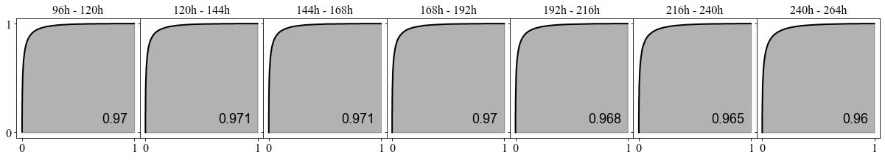

LDH cytotoxicity-vs-T2est
=========================

**Sensitivity of LDH cytotoxicity assay to the proliferation infection
point estimated using the paired 24 h AO/DAPI % viability data.**

.. code:: ipython3

    import numpy as np
    import scipy.optimize as optim
    import math
    import os,sys
    import pandas as pd
    import copy
    import matplotlib.pyplot as plt
    from matplotlib import rcParams
    import scipy.stats as st
    from scipy.stats import t
    import random as rand
    
    from sklearn.metrics import auc
    
    import copy

.. code:: ipython3

    def linear(x,a,b):
        return (a + b*x)

.. code:: ipython3

    def nonlinear(x,a,b):
        return (np.exp(a + b*x))

.. code:: ipython3

    data_folder = './data/LDHcytotoxicity'
    os.chdir(data_folder)

**Read all LDH data and map inflection point from paired 24 h AO/DAPI %
viability value.**

.. code:: ipython3

    LDH24 = pd.read_csv('cytotoxicity_data-day1.csv')
    
    tags = ['18','20','22','24']
    
    weight1 = pd.Series([0.2, 0.3, 0.4, 0.5, 0.6, 0.7, 0.8, 0.95])
    colors1 = weight1.apply(lambda x: (0,0,0,x)).tolist()
    
    all_data = {}
    
    for tag in tags:
        all_data['Assay'+tag] = LDH24['Assay'+tag].to_numpy()
        all_data['T2-'+tag] = 85.77*np.power(LDH24['AODAPI'+tag].to_numpy()/100,-1.7)
    
    cytos, t2s = [], []
    
    for tag in tags:
        for a,b in zip(all_data['Assay'+tag],all_data['T2-'+tag]):
            cytos.append(a)
            t2s.append(b)   

.. code:: ipython3

    dof = len(t2s) - 2
        
    tinv = lambda p, df: abs(t.ppf(p/2,df))
    ts = tinv(0.05,dof)

**Nonlinear regression analysis and estimation of confidence interval
and prediction bounds.**

.. code:: ipython3

    results = optim.curve_fit(nonlinear,cytos,t2s,absolute_sigma=False,full_output=True)
    
    popt, pcov = results[0], results[1]
    
    fitname = r'T2$_{\mathrm{est}}$ = exp(' + str(round(popt[0],3)) + '+' + str(round(popt[1],3)) +'%$C$)'

.. code:: ipython3

    mean_cyto = np.linspace(0.9*np.min(cytos),1.15*np.max(cytos),250)
    mean_t2 = nonlinear(mean_cyto,popt[0],popt[1])

.. code:: ipython3

    residual = nonlinear(np.array(cytos),popt[0],popt[1]) - np.array(t2s)
    norm_RSS = math.sqrt(np.dot(residual,residual)/(len(t2s)-2))
    
    RSS_text = r's.d. = ' + str(round(norm_RSS,2)) + ' h'

.. code:: ipython3

    n_samples = 10000
    
    s_is, i_is = [], []
    
    cit2_up = np.zeros(shape=mean_cyto.shape)
    cit2_low = np.zeros(shape=mean_cyto.shape)
    
    pbt2_up = np.zeros(shape=mean_cyto.shape)
    pbt2_low = np.zeros(shape=mean_cyto.shape)
    
    sigmat2_up = np.zeros(shape=mean_cyto.shape)
    sigmat2_low = np.zeros(shape=mean_cyto.shape)
    
    t2 = np.zeros(shape=mean_cyto.shape)
    effective_sigma = np.zeros(shape=mean_cyto.shape)
    
    for i in range(0,mean_cyto.shape[0]):
        samples = []
        
        a_samples, b_samples = np.random.multivariate_normal(popt,pcov,n_samples).T
        
        t2[i] = nonlinear(mean_cyto[i],popt[0],popt[1])
            
        for a_sample,b_sample in zip(a_samples,b_samples):
            samples.append(nonlinear(mean_cyto[i],a_sample,b_sample))
            
        sigma = np.std(samples)
        
        effective_sigma[i] = math.sqrt(sigma**2 + norm_RSS**2)
        
        ci95 = effective_sigma[i]*ts
            
        pbt2_low[i], pbt2_up[i] = t2[i] - ci95, t2[i] + ci95
        
        cit2_low[i], cit2_up[i] = t2[i] - sigma*ts, t2[i] + sigma*ts
        
        sigmat2_low[i], sigmat2_up[i] = t2[i] - effective_sigma[i], t2[i] + effective_sigma[i]

.. code:: ipython3

    fig, axs = plt.subplots(figsize=(8,7))
    
    rcParams['font.family'] = 'sans-serif'
    rcParams['font.sans-serif'] = ['Times New Roman']
    
    markers = {'18':'o','20':'^','22':'X','24':'D'}
    
    for tag in tags:
        plt.scatter(100-all_data['Assay'+tag],all_data['T2-'+tag],marker=markers[tag],linewidth=0,s=140,c=colors1)
        
        plt.scatter(100-all_data['Assay'+tag][-1],all_data['T2-'+tag][-1],marker=markers[tag],s=140,c='black',label='LDH '+tag)
        
    plt.xticks(size=20)
    plt.yticks(size=20) 
    
    plt.plot(100-mean_cyto,mean_t2,linewidth=4,color='#660000',alpha=0.6)#,label=fitname)
    
    plt.fill_between(100-mean_cyto,pbt2_up,pbt2_low,alpha=0.15,color='#660000',linewidth=0.0)
    plt.fill_between(100-mean_cyto,cit2_up,cit2_low,alpha=0.2,color='#000088',linewidth=0.0)
    
    plt.legend(frameon=False,prop={'size': 20},markerscale=1.0,handlelength=1.0,loc='best')
    
    plt.xlabel(r'Cytotoxicity, 100-LDH (%), 24 h',size=22)
    plt.ylabel(r'T2$_{\mathrm{est}}$ (h)',size=22,rotation=90)
    
    plt.text(15,100,RSS_text,fontsize=20)
    plt.text(15,80,fitname,fontsize=22)
    
    #plt.savefig('cytotoxicity-day1-v2-TH.png',dpi=300)

.. parsed-literal::

    Text(15, 80, 'T2$_{\\mathrm{est}}$ = exp(4.336+0.016%$C$)')

.. code:: ipython3

    #test_t2s = [96,108,120,132,144,156,168,180,192,204,216,228,240,252,264]
    test_t2s = [96,120,144,168,192,216,240,264]
    #test_t2s = [96,144,192,240]
    test_t2s.reverse()
    
    cutoff_probs = {}
    pdfs = {}
    cdfs = {}
    
    for k in test_t2s:
        cutoff_probs[k] = np.zeros(shape=mean_cyto.shape)
        pdfs[k] = np.zeros(shape=mean_cyto.shape)
        cdfs[k] = np.zeros(shape=mean_cyto.shape)
        
    responses = np.zeros(shape=(len(test_t2s),mean_cyto.shape[0]))
    
    j = 0
    
    for k in test_t2s:
        for i in range(0,mean_cyto.shape[0]):
            cutoff_probs[k][i] = st.t.sf(k,df=dof,loc=t2[i],scale=effective_sigma[i])
            pdfs[k][i] = st.t.pdf(k,df=dof,loc=t2[i],scale=effective_sigma[i])
            
        pdfs[k] *= 1.0/np.sum(pdfs[k])
        
        x = copy.deepcopy(pdfs[k][::-1])
        cdfs[k] = np.round(np.array([np.sum(x[m:]) for m in range(0,pdfs[k].shape[0])]),3)
        
        responses[j,:] = pdfs[k]
        
        j += 1

.. code:: ipython3

    fig = plt.figure(tight_layout=True,figsize=(15,10))
    gs = fig.add_gridspec(len(test_t2s),3, hspace=0)
    
    ax = fig.add_subplot(gs[:,0])
    ax.plot(100-mean_cyto,t2,linewidth=4,color='#660000',alpha=0.6,label=fitname)
    
    ax.fill_between(100-mean_cyto,pbt2_up,pbt2_low,alpha=0.15,color='#660000',linewidth=0.0)
    ax.fill_between(100-mean_cyto,sigmat2_up,sigmat2_low,alpha=0.2,color='#660000',linewidth=0.0)
    
    ax.set_title(r'T2$_{\mathrm{est}}$-vs-%$C$',size=22,pad=10)
    
    ax.tick_params(axis='both',labelsize=24)
    ax.set_yticks(test_t2s)
    ax.set_xlabel(r'100$-$%$C$, 24 h',size=24,labelpad=10)
    ax.set_ylabel(r'T2$_{\mathrm{est}}$ (h)',size=24,rotation=90,labelpad=10)
    ax.set_ylim(75,275)
    ax.set_xlim(np.min(100-mean_cyto),np.max(100-mean_cyto))
    
    for t in test_t2s:
        _alpha = 0.25 + 0.75*(t - np.min(test_t2s))/(np.max(test_t2s) - np.min(test_t2s))
        
        ax.plot(100-mean_cyto,t*np.ones(shape=mean_cyto.shape[0]),color='black',lw=3,alpha=_alpha)
        
    for k in range(len(test_t2s)):
        ax = fig.add_subplot(gs[k,1])
        
        _alpha = 0.25 + 0.75*(test_t2s[k] - np.min(test_t2s))/(np.max(test_t2s) - np.min(test_t2s))
        
        ax.plot(100-mean_cyto,cutoff_probs[test_t2s[k]],lw=3,color='black',label=str(test_t2s[k])+' h',alpha=_alpha)
        ax.tick_params(axis='y',labelsize=12)
        ax.set_ylim(-0.02,1.2)
        ax.set_xlim(np.min(100-mean_cyto),np.max(100-mean_cyto))
        ax.legend(frameon=True,prop={'size': 18,'family':'Times New Roman'},markerscale=1.0,handlelength=0.8,loc='best')
    
        ax.tick_params(axis='y',labelsize=16)
        
        if k==len(test_t2s)-1:
            ax.tick_params(axis='x',labelsize=24)
        else:
            ax.tick_params(axis='x',labelsize=0)
            
        if k==0:
            ax.set_title(r'P[T2$_{\mathrm{est}}$ $\geq$ T2$_{\mathrm{cutoff}}$]',size=22,pad=10)
            
    ax.set_xlabel(r'100$-$%$C$, 24 h',size=24,labelpad=10)
        
    for k in range(len(test_t2s)):
        ax = fig.add_subplot(gs[k,2])
        
        _alpha = 0.25 + 0.75*(test_t2s[k] - np.min(test_t2s))/(np.max(test_t2s) - np.min(test_t2s))
        
        ax.plot(100-mean_cyto,pdfs[test_t2s[k]],lw=3,color='black',label=str(test_t2s[k])+' h',alpha=_alpha)
        ax.tick_params(axis='y',labelsize=12)
        #ax.set_ylim(-0.02,1.2)
        ax.set_xlim(np.min(100-mean_cyto),np.max(100-mean_cyto))
        ax.legend(frameon=True,prop={'size': 18,'family':'Times New Roman'},markerscale=1.0,handlelength=0.8,loc='best')
    
        ax.set_ylim(-0.01,0.07)
        
        ax.tick_params(axis='y',labelsize=16)
        
        if k==len(test_t2s)-1:
            ax.tick_params(axis='x',labelsize=24)
        else:
            ax.tick_params(axis='x',labelsize=0)
            
        if k==0:
            ax.set_title('P[%$C$|T2$_{\mathrm{est}}$]',size=22,pad=10)
              
    ax.set_xlabel(r'100$-$%$C$, 24 h',size=24,labelpad=10)

.. parsed-literal::

    Text(0.5, 0, '100$-$%$C$, 24 h')

.. code:: ipython3

    wd = 3
    
    l = int((len(test_t2s)-1)*wd)
    
    fig = plt.figure(figsize=(l,wd))
    gs = fig.add_gridspec(ncols=len(test_t2s)-1, nrows=1, wspace=0)
    
    axs = gs.subplots(sharex=True,sharey=True)
    
    all_aucs = []
    
    test_t2s = test_t2s[::-1]
    
    wf = open('auc_summary.csv','w')
    print('Time interval,AUC',file=wf)
    
    for k in range(0,len(test_t2s)-1):  
        dx = copy.deepcopy(cdfs[test_t2s[k]][::-1])
        dy = copy.deepcopy(cdfs[test_t2s[k+1]][::-1])
        
        all_aucs.append(auc(dy,dx))
        
        label_text = str(round(all_aucs[-1],3))
        
        axs[k].plot(cdfs[test_t2s[k+1]],cdfs[test_t2s[k]],lw=2,color='black',label=label_text)
        axs[k].fill_between(cdfs[test_t2s[k+1]],0,cdfs[test_t2s[k]],color='black',alpha=0.3)#,label=str(test_t2s[k])+' h',alpha=_alpha)
        axs[k].set_xticks((0,1))
        axs[k].set_yticks((0,1))
        axs[k].tick_params(axis='both',labelsize=16)
        axs[k].legend(frameon=False,prop={'size': 18,'family':'Arial'},markerscale=1.0,handlelength=0.0,loc='lower right')
        axs[k].set_title(str(test_t2s[k])+'h - '+str(test_t2s[k+1])+'h',fontsize=16)
        
        output_string = str(test_t2s[k+1])+'h - '+str(test_t2s[k])+'h'
        output_string += ',' + label_text
        
        print(output_string,file=wf)
        
    wf.close()

.. code:: ipython3

    LDH0 = pd.read_csv('cytotoxicity_data-day0.csv')
    
    tags = ['17','19','21','23']
    
    weight1 = pd.Series([0.2, 0.3, 0.4, 0.5, 0.6, 0.7, 0.8, 0.95])
    colors1 = weight1.apply(lambda x: (0,0,0,x)).tolist()

.. code:: ipython3

    all_data = {}
    
    for tag in tags:
        all_data['Assay'+tag] = LDH0['Assay'+tag].to_numpy()
        all_data['T2-'+tag] = 85.77*np.power(LDH0['AODAPI'+tag].to_numpy()/100,-1.7)

.. code:: ipython3

    cytos, t2s = [], []
    
    for tag in tags:
        for a,b in zip(all_data['Assay'+tag],all_data['T2-'+tag]):
            cytos.append(a)
            t2s.append(b) 

.. code:: ipython3

    results = optim.curve_fit(linear,cytos,t2s,absolute_sigma=False,full_output=True)
    
    popt, pcov = results[0], results[1]
    
    p_std = np.sqrt(np.diag(pcov))
    
    fitname = r'T2$_{\mathrm{est}}$ = ' + str(round(popt[0],2)) + '+' + str(round(popt[1],2)) +'%$C$'

.. code:: ipython3

    mean_cyto = np.linspace(np.min(cytos),np.max(cytos),50)
    mean_t2 = linear(mean_cyto,popt[0],popt[1])

.. code:: ipython3

    residual = linear(np.array(cytos),popt[0],popt[1]) - np.array(t2s)
    
    norm_RSS = math.sqrt(np.dot(residual,residual)/(len(t2s)-2))
    
    print(norm_RSS)
    
    RSS_text = r's.d. = ' + str(round(norm_RSS,2)) + ' h'

.. parsed-literal::

    45.01553502351084

.. code:: ipython3

    result = st.linregress(np.array(cytos),t2s,alternative='two-sided')
    print(result)
    
    r_text = r'R$^2 = ' + str(round(result.rvalue**2,3)) + '$'

.. parsed-literal::

    LinregressResult(slope=18.739469338030542, intercept=-23.327390771236196, rvalue=0.5835731831758544, pvalue=0.0004549994945882279, stderr=4.760907551904148, intercept_stderr=39.48775011266707)

.. code:: ipython3

    n_samples = 10000
    
    s_is, i_is = [], []
    
    t2_up = np.zeros(shape=mean_cyto.shape)
    t2_low = np.zeros(shape=mean_cyto.shape)
    
    rt2_up = np.zeros(shape=mean_cyto.shape)
    rt2_low = np.zeros(shape=mean_cyto.shape)
    
    effective_sigma = np.zeros(shape=mean_cyto.shape)
    
    for i in range(0,mean_cyto.shape[0]):
        samples = []
        
        a_samples, b_samples = np.random.multivariate_normal(popt,pcov,n_samples).T
            
        for a_sample,b_sample in zip(a_samples,b_samples):
            samples.append(linear(mean_cyto[i],a_sample,b_sample))
            
        sigma = np.std(samples)
        
        effective_sigma[i] = math.sqrt(sigma**2 + norm_RSS**2)
        
        ci95 = effective_sigma[i]*ts
            
        t2_low[i], t2_up[i] = mean_t2[i] - ci95, mean_t2[i] + ci95
        
        rt2_low[i], rt2_up[i] = mean_t2[i] - sigma*ts, mean_t2[i] + sigma*ts

.. code:: ipython3

    fig, axs = plt.subplots(figsize=(8,7))
    
    rcParams['font.family'] = 'sans-serif'
    rcParams['font.sans-serif'] = ['Times New Roman']
    
    markers = {'17':'o','19':'^','21':'X','23':'D'}
    
    for tag in tags:
        plt.scatter(100-all_data['Assay'+tag],all_data['T2-'+tag],marker=markers[tag],linewidth=0,s=140,c=colors1)
        
        plt.scatter(100-all_data['Assay'+tag][-1],all_data['T2-'+tag][-1],marker=markers[tag],s=140,c='black',label='LDH '+tag)
        
    plt.plot(100-mean_cyto,mean_t2,linewidth=4,color='#660000',alpha=0.6)#,label=fitname)
    
    plt.xticks(size=20)
    plt.yticks(size=20) 
    
    plt.xlim(87,96)
    
    plt.fill_between(100-mean_cyto,rt2_up,rt2_low,alpha=0.2,color='#000088',linewidth=0.0)
    
    plt.legend(frameon=False,prop={'size': 18},markerscale=1.0,handlelength=1.0,loc='lower left')
    
    plt.xlabel(r'Cytotoxicity, 100-%$C$, 0 h',size=22)
    plt.ylabel(r'T2$_{\mathrm{est}}$ (h)',size=22,rotation=90)
    plt.text(93.5,270,r_text,fontsize=18)
    
    plt.ylim(0,300)
    
    plt.text(93,245,RSS_text,fontsize=22)
    
    plt.text(91,220,fitname,fontsize=22)

.. parsed-literal::

    Text(91, 220, 'T2$_{\\mathrm{est}}$ = -23.33+18.74%$C$')

